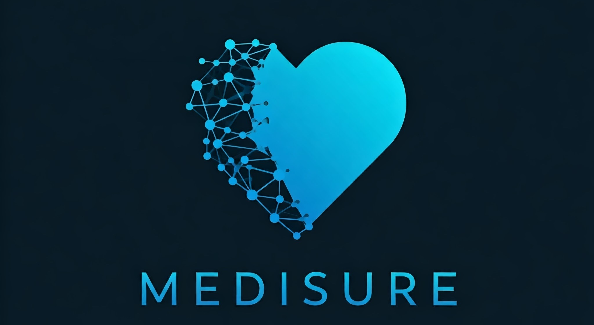

# MediSure

MediSure is a user-friendly chatbot designed to help individuals taking medication optimize its effectiveness by providing personalized recommendations on what foods to eat and what to avoid. It also helps users understand which medications are safe to take together and which combinations pose potential risks. By offering clear, accessible advice, MediSure empowers people to make informed decisions that support their health and well-being while minimizing any adverse interactions between their medications, diet, or other medicines.

## Features

### 1. Medication Interaction Alerts
- **Safe and risky medication combinations**: Alerts that inform users of safe medicines they can take together, and warnings about risky interactions.
- **Real-time medication check**: Users can input multiple medications they’re taking to see potential conflicts or safety issues.

### 2. Personalized Food Recommendations
- **Food interactions**: Detailed information on foods to eat or avoid while taking specific medications, enhancing their effectiveness and reducing side effects.

### 3. User-Friendly Interface
- **Intuitive chatbot**: A chatbot that guides users through the process of entering medications and provides responses in a conversational style.
- **Responsive design**: The website works seamlessly on desktops, tablets, and mobile devices.
- **Easy input system**: Search functionality for medications and foods, making it simple for users to find what they need.

## APIs Used

- **OpenAI API**: Used for natural language processing to power the chatbot and provide responses in a conversational style. [OpenAI API Documentation](https://beta.openai.com/docs/)
- **CACTUS API**: Used to generate InChI keys for chemical structures. [CACTUS API Documentation](https://cactus.nci.nih.gov/chemical/structure)

## Usage

After accessing the website, simply enter the medication you are taking or select it from the categories shown on the website. You will receive personalized recommendations, including what foods to eat, what to avoid, and potential medication interactions.

## License

MIT License

Copyright (c) 2024 MediSure Development Team

Permission is hereby granted, free of charge, to any person obtaining a copy of this software and associated documentation files (the "Software"), to deal in the Software without restriction, including without limitation the rights to use, copy, modify, merge, publish, distribute, sublicense, and/or sell copies of the Software, and to permit persons to whom the Software is furnished to do so, subject to the following conditions:

The above copyright notice and this permission notice shall be included in all copies or substantial portions of the Software.

THE SOFTWARE IS PROVIDED "AS IS", WITHOUT WARRANTY OF ANY KIND, EXPRESS OR IMPLIED, INCLUDING BUT NOT LIMITED TO THE WARRANTIES OF MERCHANTABILITY, FITNESS FOR A PARTICULAR PURPOSE AND NONINFRINGEMENT. IN NO EVENT SHALL THE AUTHORS OR COPYRIGHT HOLDERS BE LIABLE FOR ANY CLAIM, DAMAGES OR OTHER LIABILITY, WHETHER IN AN ACTION OF CONTRACT, TORT OR OTHERWISE, ARISING FROM, OUT OF OR IN CONNECTION WITH THE SOFTWARE OR THE USE OR OTHER DEALINGS IN THE SOFTWARE.
